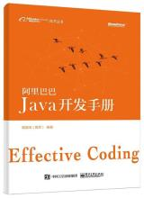

------

### 				《阿里巴巴 java开发手册》--随手记

------

```

```

> *`这本开发手册是阿里巴巴开发人员的java开发规范，读了这本书后，感受到代码规范的重要性，培养自己的代码风格，养成与此手册代码风格一致的习惯。`*

```

```

​								

### 一、编程规约

#### 1 命名风格

1) 代码中的变量命名均不能以下划线或美元符号开始，也不能以下划线或美元符号结束。

2) 代码中不允许使用中文拼音。

3) 类名尽量使用UpperCamelCase风格，即首字母要大写，其他字母小写，特殊类除外，如PO、DAO等。

4) 方法名、参数名、成员变量、局部变量等统一采用lowerCamelCase风格，驼峰形式。

5) 常量命名要全部大写，单词间用下划线隔开。

6) 抽象类命名使用Abstract或Base开头，异常类的命名使用Exception结尾，测试类命名以它要测试的类名开始，以Test结尾。

7) 类型与中括号之间无空格相连定义数组。例：int[] arrayDemo;

8) POJO类的boolean类型的变量前不要加is前缀，否则部分框架会解析错误。例：属性为isDeleted 它的方法也为isDeleted()，框架会去找Deleted属性，找不到就会报错。

9) 定义包名统一用小写，单数，类名可以使用复数：例 Utils 类。

10) 杜绝完全不规范的缩写，避免词不达意。

11) 在进行变量命名时，尽量使用完整的单词，不要嫌变量名称过长。

12) 如果使用了设计模式，那么，在定义类的时候尽量使用体现这种模式的单词，例：使用了工厂模式，则定义类名时，后缀要加Factory.

13) 接口中方法和属性不要加任何的修饰符号，保持整洁，因为接口中的方法默认为public abstract 修饰，这两个修饰可省略。字段默认为public final static 修饰。

14) 接口与实现类的命名，在实现类后面加Impl后缀。

15) 枚举类名尽量带上Enum后缀，成员变量全部大写。

#### 2 常量定义

1) 不允许任何魔法值，即在代码中直接使用未经预先定义的常量。常量一定要在开始定义，并加上注释。

2) 定义long或Long型常量时，一定要用大写的L，不可以使用小写的l，易与1混淆。

3) 尽量不要使用一个大而全的类维护所有的常量类，可以根据类型用多个类来维护。

#### 3 代码格式

1) 大括号的使用约定。如果大括号内为空，则简洁的写成{}即可，若非空，则

- 左大括号前不换行。
- 左大括号后换行。
- 右大括号前换行。
- 右大括号后还有else等代码则不换行；表示终止的则应换行。

2) 左小括号与字符之间不空格，右括号同此。例：if (a == b)

3) if / for / while / switch / do 等保留字与括号之间必须空格。

4) 任何二目、三目运算符的左右两边都要加空格。

5) 需要首行缩进的时候，采用4个空格，不要使用Tab控制符。

6) 注释的双斜线与内容之间有且仅有一个空格。

7) 单行字符数不超过120个，超出则需要换行，换行时遵守如下原则。

- 第二行相对第一行缩进4个空格，从第三行开始，不在进行缩进。
- 运算符与下文一起换行。
- 方法调用的点符号与下文一起换行。
- 方法调用中的多个参数需要换行时，在逗号后进行。
- 在括号前不要换行。

8) 方法参数在定义和传入时，多个参数都厚后边必须加空格。例： method("one", "two", "three");

9) IDE的text file encoding 设置为UTF-8，换行符使用UNIX格式，不用用windows格式。

10) 没有必要增加增加空格来使代码对应字符对齐。

#### 4 OOP规约

1) 调用一个类的静态方法或变量，直接使用类名调用，不要使用类的实例来调用，会增加编译成本。

2) 所有的覆盖方法，必须加@override 注释，表明该方法已被重写。

3) 使用java方法的可变参数时，最好所有的参数类型一致，不要使用Object 类型。

4) 对外部正在调用或二方库依赖的接口，不允许修改方法签名，若要修改必须使用@Deprecated注解，并说明修改内容。

5) 不嫩使用过时的类或方法。

6) 使用equals()方法时，应将常量放在前面。

7) 对象之间的比较一定要用equals方法，==比较的是变量的地址是否相同。

8) 关于基本数据类型与包装类型的使用标准如下：

- 所有的POJO类属性必须使用包装数据类型。
- RPC方法的返回值和参数必须使用包装类型。
- 所有的局部变量最好使用基本类型。

9) 在创建POJO类时，不要设定默认值。

10) 当序列化类新增属性时，不要修改serialVersionUID字段，避免反序列化失败。

11) 构造方法中禁止加入任何的业务逻辑，若有初始化，请放入init方法中。

12) POJO类必须写toString()方法。

13) 在使用split()方法得到数组时，需要在最后一个做无内容检查。

14) 当一个类有多个同名方法进行重载时，要放在一起，便于阅读。

15) 在循环体重，字符串的扩展要用StringBuilder的append()方法。

20) 类成员与方法访问控制从严

|           |  包外  |  同包  |  子类  | 同一个类 |
| :-------: | :--: | :--: | :--: | :--: |
|  public   |  √   |  √   |  √   |  √   |
|  default  |      |  √   |  √   |  √   |
| protected |      |      |  √   |  √   |
|  private  |      |      |      |  √   |

#### 5 集合处理

1) 关于hashCode 和 equals 的处理，遵循如下规则：

- 只要重写equals，就必须重写hashCode。
- 因为Set存储的是不重复的对象，依据hashCode和equals进行判断，所以Set存储的对象必须重写这两种方法。
- 如果自定义对象作为Map的键，那么必须重写hashCode和equals方法，因为Map的键也是使用Set集合。

2) ArrayList的subList结果不可强转为ArrayList，因为subList是ArrayList的一个内部类。

3) 在subList场景中，高度注意对原集合元素个数的修改，会导致子列表的遍历、增加、删除均产生异常。

4) 使用集合转数组的方法，必须使用集合的toArray(T[] array),传入的是类型完全一样的数组。

5) 在使用工具类Arrays.asList()把数组转换成集合时，不能使用其修改集合的相关方法，否则会抛出异常。

6) 泛型通配符<? extends T>用来接收返回的数据，此写法的泛型集合不能使用add方法，而<? super T>不能使用get方法，因为其作为接口调用易出错。

7) 不要在foreach循环里进行元素的remove/add操作，remove元素请使用Iterator方式，如果并发操作，请用锁。

8) 在jdk7 及以上版本中，Comparator要满足如下三个条件，不然Arrays.sort，Collections.sort会报错。

x,y 的比较结果和y,x的比较结果相反。

x>y,y>z,则x>z

x=y,则x,z比较结果和y,z比较结果相同。

9) 尽量在集合初始化时，指定集合初始值的大小。

10) 使用entrySet遍历Map类集合K/V，而不是用keySet方式遍历。

- values()返回的是V值得集合，是一个list集合对象。
- keySet()返回的是K值集合，是一个Set集合对象。
- entrySet()返回的是K/V值组合集合。

#### 6 并发处理

1) 获取单例对象需要保证线程安全，其中的方法也要保证线程安全。

2) 在创建线程或线程池时，请指定有意义的线程名称，方便出错时回溯。

3) 线程资源必须通过线程池提供，不允许在应用中自行显示创建线程。

4) 线程池不允许使用Executors创建，而是通过ThreadPoolExecutor的方式创建，Executors返回的线程池对象的弊端如下：

FixedThreadPool和SingleThreadPool：允许的请求队列长度为Inter.Max_VALUE，可能会堆积大量的请求，从而导致OOM。

CachedThreadPool 和 ScheduledThreadPool：可允许的创建线程数量为Inter.MAX_VALUE，可能会创建大量的线程，从而OOM。

5) SimpleDateFormat 是线程不安全的类，一般不要定义为static变量，如果定义为static，必须加锁，或者使用DateUtils工具类。

6) 在高并发场景中，同步调用应该考虑锁的性能损耗。能用无锁数据结构，就不要用锁；能锁区块，就不要锁整个方法体；能用对象锁，就不要用类锁。

7) 在对多个资源、数据库表、对象同时加锁时，需要保持一致的加锁顺序，否则可能出现死锁。

8) 在并发修改同一记录时，为避免更新丢失，需要加锁，在应用层或者缓存层加锁或者数据库加锁。

9) 运用多线程并行处理定时任务的情况，在Timer运行多个TimeTask时，只要其中之一没有捕获抛出的异常，其他任务便会自动终止运行。如果在处理定时任务时使用ScheduledExecutorService，则没有这个问题。

#### 7 控制语句

1) 在一个switch块内，每个case要么通过break/ return 等来终止，要么注释说明程序将执行到哪一个case为止；在一个switch块内，都必须包含一个default语句并且放在最后，即使它什么代码也没有。

2) 在 if / else / for / while / do 等语句中，必须使用大括号，即使只有一条语句。

3) 在高并发场景中，避免使用“等于”判断作为中断或退出条件。

4) 在表达异常的分支时，尽量少用if-else方式，这种方式可以改写成卫语句。

5) 不要在条件判断中执行其他复杂的语句，可以将其赋给boolean类型。

#### 8 注释规约

1) 类、类属性、类方法的注释必须使用javadoc规范。

- 使用IDE时，若方法有javadoc，则不需要进入方法，就可以看见该方法的详细信息。

2) 所有的抽象方法必须要用javadoc注释，除了返回值、参数、异常说明外、还必须指出该方法实现什么功能。

3) 所有类都必须添加创建者和创建日期。

4) 方法内部的单行注释，在被注释语句上方另起一行，使用//注释。

5) 所有的枚举类型字段都必须有注释，说明每个数据项的用途。

6) 在进行代码修改的同时，也要对注释进行修改。

### 二、异常日志

#### 1 异常处理

1) java类库中定义的可以通过预检查方式规避的RuntimeException不应该通过catch的方式来处理，如：IndexOutOfBoundsException等。

2) 异常不要用来做流程控制、条件控制。

3) catch时请分清稳定代码和非稳定代码。

4)  捕获异常是为了处理它，不要捕获了却什么都不处理而抛弃之，如果不想处理它，请将该异常抛给它的调用者

5) 有try块放到了事物代码中，catch异常后，如果需要回滚事务，一定要注意rollback事务。

6) finally 块必须对资源对象、流对象进行关闭操作，即使有异常也要做try-catch操作。

7) 不能再finally里使用return语句，否则不会执行try里面的return语句。

8) 捕获异常与抛异常必须完全匹配，或者捕获异常是抛异常的父类。

9) 可以返回空值，但是请尽量注释说明情况。

10) 应尽量避免NPE(NullPointException)异常。

11) 以其他系统交互时，出现异常，最好捕捉后，返回给其他系统错误码的形式。

#### 2 日志规约

1) 应用中不可直接使用日志系统(Log4j、Logback)中的API，而应该依赖使用日志框架SLF4J中的API。

2) 日志文件推荐至少保存15天，因为有些异常具备以"周"为频次发生的特点。

3) 日志的命名方式最好为：appName_logType_logName.log。

4) 对trace/debug/info 级别的日志输出，必须使用条件输出形式或者占位符的方式。

5) 避免重复打印日志，否则会浪费磁盘空间。务必在日志配置文件中设置additivity = false。

6) 异常信息应该包括两种：案发现场信息和异常堆栈信息。

### 三、单元测试

1) 好的单元测试必须遵守AIR（Automatic、Independent、Repeatable）原则。

2) 单元测试应该是全自动执行的。

3) 保持测试单元的独立性。

4) 单元测试是可以重复执行的，不能受到外界环境的影响。

5) 对于单元测试，要保证测试粒度足够小，有助于精确定位问题。

6) 核心业务、核心应用、核心模块的增量代码确保单元测试通过。

7) 单元测试代码要有独立的路径，不允许写在业务代码目录下。

8) 对于数据库的连接测试，设置回滚机制，不要造成垃圾数据。

### 四 安全规约

1) 隶属于用户个人的页面或者功能必须进行权限控制校验。

2) 用户敏感数据禁止直接展示，必须进行脱敏。

3) 用户输入的SQL参数严格使用参数绑定或者METADATA字段值限定，防止SQL注入，禁止字符串拼接访问数据库

4) 用户请求传入的任何参数必须做有效性验证。

5) 禁止向HTML页面输出未经安全过滤或未正确转义的用户数据。

6) 表单、AJAX提交必须执行CSRF安全过滤。

7) 在使用平台资源时，如 短信、邮件、电话、下单、支付，必须实现正确的防重发限制。

### 五、MySql数据库

#### 1 建表规约

1) 表达是与否概念的字段，必须使用is_xxx的方式命名，数据类型是unsigned tinyint。

2) 表名、字段名必须使用小写字母或数字，禁止出现数字开头、禁止两个下划线中间只出现数字。

3) 表名不使用复数名词。

4) 禁用保留字，如 desc、range、match等。

5) 主键索引名为pk字段名，唯一索引名为uk__字段名，普通索引名则为idx_字段名。

6) 小数类型为decimal，禁止使用float和double。

7) 如果存储的字符串长度几乎相等，则应使用char定长字符串类型。

8) varchar是可变长字符串，不预先分配存储空间，长度不要超过500个字符。

9) 表必备三字段：id（主键）、gmt_create（创建时间）、gmt_modified（修改时间）。

10) 表的命名最好加上"业务名称_表"的作用。

11) 库名与应用名称尽量一致。

12) 修改表字段时要及时增加备注。

13) 字段允许适当冗余，以提高查询性能，但必须考虑数据一致，冗余字段应遵循：

- 不是频繁修改的字段。
- 不是varchar超长字段，更不是text字段。

14) 当单表行数超过500万行或者单表容量超过2GB时，才推荐进行分库分表。

15) 设置合适的字符存储长度，不但可以节约数据库表空间和索引存储，更重要的是能够提升检索速度。

#### 2 索引规约

1) 业务上具有唯一特性的字段，即使是多个字段的组合，也必须建成唯一索引。

2) 超过三个表禁止join。需要join的字段，数据类型必须绝对一致；当多表关联查询时，保证被关联的字段需要有索引。

3) 在varchar字段上建立索引时，必须指定索引长度，没必要对全字段建立索引，根据实际文本区分度绝对索引长度。

4) 页面搜索严禁左模糊或全模糊，如果需要请通过搜索引擎来解决。

#### 3 SQL语句

1) 不要使用count(列名)或count(常量)来替代count(*)。

2) count(distinct col)计算该列除NULL外的不重复行数。注意count(distinct col1，col2)，如果其中一列全为NULL，那么即使另一列有不同的值，也返回为0.

3) 当某一列的值全为NULL时，count(col)的返回结果为0，但sum(col)返回结果为NULL，因此使用sum()时，需注意NPE问题。

4) 使用ISNULL来判断是否为NULL值。

- NULL <> NULL的返回结果是NULL，而不是false。
- NULL = NULL 的返回结果是NULL，而不是false。
- NULL <> 1 的返回结果是NULL，而不是true。

5) 在代码中写分页查询逻辑时，若count为0应直接返回，避免执行后面的分页语句。

6) 不得使用外键与级联，一切外键概念必须在应用层解决。

7) 禁止使用存储过程，存储过程难以调试和扩展，更没有移植性。

8) 数据订正时，要先select、确认无误后才能执行更新语句。

9) in 操作能避免则避免，若实在避免不了，in后面的要控制在1000个以内。

10) truncate table 比 delete速度快，且使用的系统和事物日志资源少，但truncate无事物且不触发trigger，有可能造成事故。

#### 4 ORM映射

1) 在表查询中，一律不要使用*作为查询的字段列表，需要哪些字段必须明确写明。

2) POJO类的布尔属性不能加is，而数据库字段必须加is_，要求在resultMap中进行字段与属性之间的映射。

3) 不要用resultClass作为返回参数，即使所有类属性与数据库字段一一对应，也需要定义。

4) sql.xml 配置参数使用：#{}，#param#，不要使用${}，此种方式容易出现sql注入。

5) iBATIS自带的queryForList(String statementName，int start,int size)不推荐使用。

6) 不允许直接拿HashMap与Hashtable作为查询结果集的输出。

7) 更新数据表记录时，必须同时更新记录对应的gmt_modified（更新时间）字段为当前时间。

------

*`其实本开发手册还有一些其他的要点内容，但是，由于我读此书的目的只是想要规范我的代码风格，因此，其外的方面，在本笔记中不予记述。`*

------

#### 六 使用阿里巴巴开发手册eclipse插件

**关于插件代码**，阿里巴巴在2017年已经开源，[点击此处查看插件代码](https://github.com/alibaba/p3c/tree/master/eclipse-plugin)。

1) 打开eclipse、选择help -> Install New Software...


2) 输入URL:https://p3c.alibaba.com/plugin/eclipse/update 点击add按钮。


3) 输入name，点击OK按钮。


4) 选择插件，点击next按钮。

 

5) 接下来一直下一步，最后点击接受协议即可，安装完成后，需要重启eclipse。

6) 让我们来感受一下alibaba插件的魅力吧。


**结果：**


------

